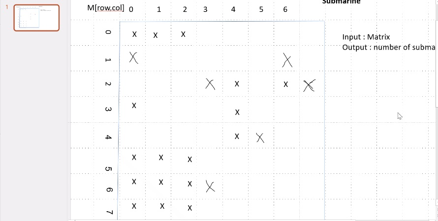

# The problem
Given a 2D array which represents an ocean of `'1'`s (Submarine cells) and `'0'` (water),
return the number of submarines. A submarine is formed by connected `'1'`s that are surrounded
by water.

# The general algorithm idea 
First, traverse the 2D array. When we find an index with value of `'1'` which is unvisited,
we scan for all the connected 1's, mark them all as visited and increment our counter. 
Repeating this process till the end of the 2D array.

My first solution was using [DFS](https://en.wikipedia.org/wiki/Depth-first_search), which in my design involved recursion, I imagine that in 
many real company problems, using recursion might not be memory efficient, so I offered 
another solution, using [BFS](https://en.wikipedia.org/wiki/Breadth-first_search).

## Solution 1 (DFS):	
We search for the connected `'1'`s by recursively splitting in 4 directions in the matrix, 
until reaching a value which is not an unvisited `'1'`.

## Solution 2 (BFS):
We search for the connected `'1'`s by using a Breadth-first search, Keeping track of closest
`'1'`s with a List while splitting in 4 directions until reaching a value which is not an unvisited `'1'`.

